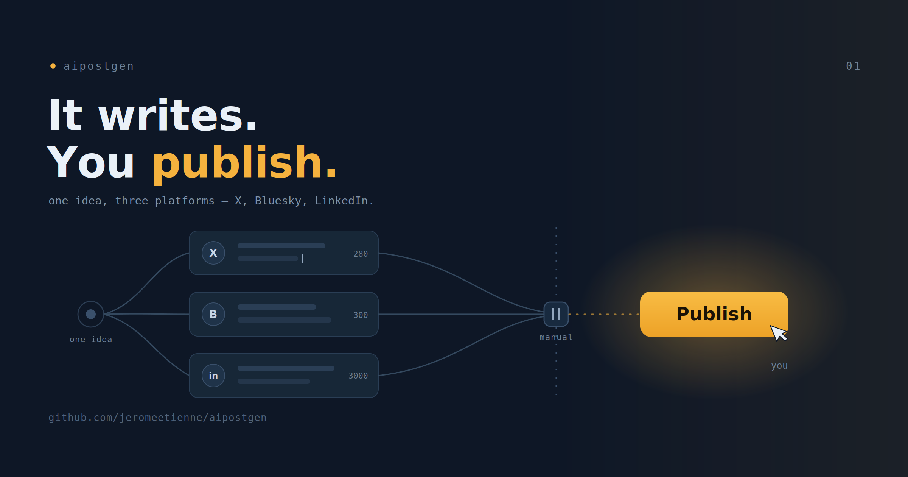

# My AI Does the Writing. I Do the Publishing.

I post the same idea to three places: X, Bluesky, and LinkedIn. Each one wants
something different. X wants it short. LinkedIn wants context and a link in the
first comment. Bluesky sits somewhere in between. So one thought becomes three
rewrites, three sets of limits, three slightly different voices. Most of the time
I just did not bother, and the idea stayed in my head.

So I built a tool to do the typing. It is called `aipostgen`. It takes one input, a
link, a public code repository, or a few words, and it gives me a finished draft
for each platform, written in my voice and inside each platform's limits.

The interesting decision is not what I let it do. It is what I refused to let it
do. `aipostgen` never publishes. It stops at paste-ready text and hands the keys
back to me. I want to explain why a writing tool that does not press the button
is the version I actually trust.

> The complete project is open source: [repository](https://github.com/jeromeetienne/aipostgen)

## What a Run Feels Like

I give it a link. A few seconds later it does not show me three drafts. It shows
me one thing: the angle. A sentence or two saying, here is what I think this post
is about, here is the take I would write toward.

This is the first place it stops and waits. If the angle is wrong, I say so, and
it tries again. This costs almost nothing, because no drafting has happened yet.
I have caught it pointing at the wrong idea many times, and each time the fix was
one sentence from me instead of three rewritten posts I would have had to throw
away.

Once I approve the angle, it generates an image from a short brief and shows me
that too. Then it writes: one draft per platform. Each draft goes through a
review pass that checks it against a quality bar and rewrites it if it falls
short, at most twice, so it does not loop forever chasing a perfect post.

Then it stops a second time. It shows me the finished drafts. I approve them, or
I edit any single one, and only then does it print the paste-ready text, the
image to attach, and for LinkedIn the link to drop in the first comment.

Two stops in the whole run. Approve the angle early, approve the drafts late.
Everything between those two points is the machine doing the tedious part.

## Why It Stops Twice

I could have built the one-shot version. Paste a link, get three posts, done.
It demos better. It also produces whatever the first attempt happens to produce,
with no chance for me to correct the direction and no guard before something
public goes out.

I did not want that, for a plain reason. These posts go to real accounts with my
name on them. A bad post is public and hard to take back. So I designed around
the cost of a mistake rather than the thrill of full automation.

The two stops are placed where they are worth the interruption. The angle gate is
early and cheap, and it catches the most expensive error: writing well toward the
wrong idea. The approval gate is late, and it catches weak copy before it reaches
anyone. In between, I leave the model alone to do what it is genuinely good at,
which is turning a clear angle into clean copy three different ways.

I will admit the friction is real. Two stops per run is more work than zero. For
a while I wondered if I was being precious about it. Then I watched how often I
used the angle stop to redirect the whole post, and how often I used the final
stop to fix one word that was not mine, and I stopped second-guessing it. The
friction is the product. It is the part that lets me trust the output enough to
post it.

## The Part It Refuses to Do

Here is the line I drew. aipostgen does the writing. It does not do the
publishing. The last step, the actual copy and paste into each app, is mine.

This is on purpose, and not only out of caution. Publishing to three platforms
means driving browsers and clients and login sessions, the fragile machinery that
breaks the week after you build it. Bolting that on first would have put the
shaky part in front of the valuable part. The value is good drafts. So I shipped
good drafts, and I left the button for me to press.

There is a quieter reason too. A tool that stops one step short keeps a human in
the loop at exactly the moment that matters, the moment before something becomes
public. I would rather press the button myself and own it than wake up to
something my tool decided to say.

## What I Was Really Testing

aipostgen is useful to me, and that was the point. But underneath, I was testing
a way of thinking about these tools. The model is good at the open-ended part:
research, an angle, three voices. It is not the thing I want holding the steps,
deciding what happens next, or choosing when to publish. I kept those decisions
in plain code and in my hands, and I let the model do the writing.

That split, what the machine decides versus what a human decides, is the whole
design. In the next post I will open it up and show how it is built. For now the
short version is the one I started with. My AI does the writing. I do the
publishing. That is the feature.

If you want to try it or read the code, it is on GitHub:
[github.com/jeromeetienne/aipostgen](https://github.com/jeromeetienne/aipostgen).
