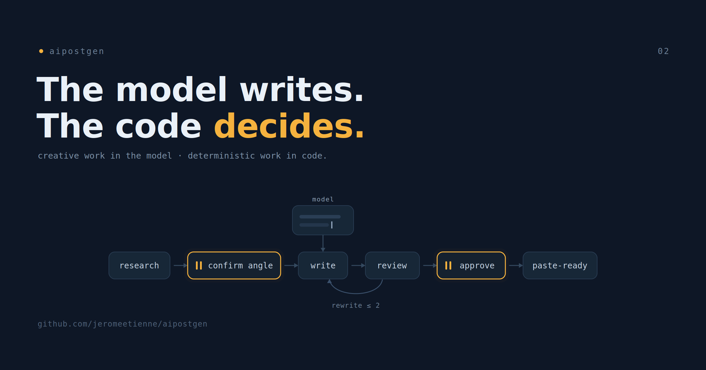

# How I Built aipostgen: The Model Writes, the Code Decides

In the first post I described `aipostgen` from the outside. You give it a link, it
shows you an angle and waits, it writes a draft for X, Bluesky, and LinkedIn, it
checks each one, and it stops for your approval before handing back paste-ready
text. This post is about the inside. How is it actually built, and why those
choices.

The short version is one sentence. The language model does the writing. Plain
code does the deciding. Almost every design choice in `aipostgen` falls out of
keeping those two jobs apart.

> The complete project is open source: [repository](https://github.com/jeromeetienne/aipostgen)



## The Shape

A run moves through four phases with two stops:

```
research → ✋ confirm angle → write → review ⤿ rewrite → ✋ approve → 📋 paste-ready
```

Research reads the input and writes a small bundle: the angle, the claims with
their sources, and a brief for the image. Write turns that bundle into one draft
per platform. Review judges each draft and sends weak ones back for a rewrite, at
most twice, then the survivors come to me. The two stops are the angle gate, early
and cheap, and the approval gate, late and final.

That is a state machine. There is an order, a loop, a cap on the loop, and two
points where the run pauses for a human. Order-sensitive logic, and none of it
creative.

## Where I Put the Control Flow

Here is the choice I am most sure about. The control flow, the phase order, the
rewrite loop, the two-pass cap, and the gates, lives in a small TypeScript
command-line tool. The tool owns the run's state on disk and decides the next
action. The model never decides which phase it is in.

The tempting alternative was to write the whole thing as a prose instruction and
let the model run the loop in its head. It would have been faster to stand up. I
did a self-review of that design and did not like what I saw. It puts the least
reliable component, the model, in charge of the most order-sensitive logic, the
loop and the cap and the order. The model is wonderful at writing and shaky at
remembering on every single run that the rewrite loop runs at most twice. So I
gave that job to code, where a loop runs the same way every time and I can test it
in isolation.

I will go deeper on why this matters in the third post, because the idea reaches
well past this one tool. Here I will just state it as the fact the rest of the
build rests on. Deterministic work belongs in code. Creative work belongs in the
model.

## A Manager and Two Contractors

`aipostgen` runs on Claude Code, which gives me three building blocks: a skill, a
subagent, and a command. I had to map the pipeline onto them, and the mapping was
not obvious.

The orchestrator is a skill that runs in the main thread, the place that can talk
to me. Think of it as the manager. It holds the run, drives the loop, and runs
the two gates. The gates are the reason it has to stay in the main thread. A
subagent runs in its own isolated context and returns one result. It cannot stop
and ask me a question, and the whole point of `aipostgen` is that it stops and asks
me twice.

Two jobs do become subagents, the contractors. Research is one, because it reads a
large amount and I want all that intake kept out of the main context where it
would crowd everything else. Review is the other, and this one I am a little proud
of. I send review to a fresh subagent that never watched the draft being written.
A reviewer that saw the writing happen is biased toward it. A reviewer arriving
cold judges the draft on its own terms. Writing itself stays in the main thread,
next to the loop and the gates that surround it.

So: manager in the middle holding the conversation, research sent off to read in
isolation, review sent off to judge without having seen the work. Each piece is
where it is for one concrete reason.

## How It Knows My Voice

A tool that writes in my voice has to be told what my voice is, and I did not want
that buried in code. Three plain markdown files in a folder decide how posts come
out: one for how they sound, one for what counts as good enough, and one for the
length limits. I edit them like notes, and the changes apply on the next run.

The one I am happiest with is the quality bar, the file the review step judges
against. It has a calibration rule written at the top: every one of my real
example posts must pass this file. If a rule in it would reject a post I actually
wrote and was happy with, the rule is wrong, not the post. I checked it against
seven of my real posts and all seven pass. That gives the bar an honest anchor. It
is not my guess about what good writing is. It is tuned so that my own writing
clears it, which means when it rejects a draft, the draft really did fall below
the line I already write above.

## What I Would Do Differently

Two things are not as clean as I would like. One of the libraries the runner
depends on is used in the code but missing from the package file, the kind of gap
that works on my machine and bites a fresh checkout. That is a plain bug I should
close. The other is a rougher edge in the platform itself. A freshly written
subagent only registers at the start of the next session, so writing a new agent
and using it are not the same sitting. It is a small thing, but it surprised me,
and it is the sort of detail worth knowing before you build on the same blocks.

Neither changes the core, and I would rather name them than pretend the build was
frictionless.

## The One Idea Underneath

Step back and the whole design is one decision applied at every level. The model
writes. The code decides. The gates, the loop, the cap, the phase order, the
manager and contractor split, even where the voice rules live, all of it follows
from refusing to let the model hold the parts that need to behave the same way
every time.

That decision deserves its own post, because it is the part that travels beyond
`aipostgen` to any tool built on a language model. That is the next one.

The code is on GitHub if you want to look:
[github.com/jeromeetienne/aipostgen](https://github.com/jeromeetienne/aipostgen).
