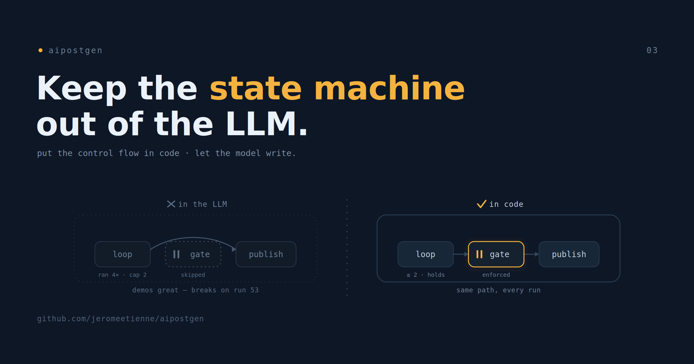

# Keep the State Machine Out of the LLM

This is the third post about aipostgen, the tool I built to write my social posts.
The first post was the experience. The second was the build. This one is the
single idea underneath both, and it is the part I would carry into any tool built
on a language model, not just this one.

Here it is plainly. Do not let the model run your control flow. Put the state
machine in code. Let the model do the writing.

> The complete project is open source: [repository](https://github.com/jeromeetienne/aipostgen)

## The Design That Demos Well and Fails Quietly

When you build something with an agent, the seductive shape is this: describe the
goal, hand the model some tools, and let it decide what to do next. It looks like
magic the first few times. The model picks a step, then another, then announces it
is finished. No state machine to write, no phases to wire up. You feel like you
got the whole orchestration for free.

Then you run it a hundred times. Somewhere in there it skips a step. Somewhere
else it does a step twice. A loop you meant to cap at two tries runs four, because
on that particular run the model lost count. A gate you put in to stop and ask the
user gets quietly stepped over, because nothing forced it to stop, there was only
an instruction politely asking it to. None of these fail loudly. They fail on run
fifty-three, in a way you cannot reproduce on run fifty-four, which is the worst
kind of failure to chase.

The reason is not that the model is bad. It is that you handed the least
predictable component the most order-sensitive job. A state machine is the one
thing in your system that has to behave identically every single time. The model
is the one thing in your system that, by design, does not.

## Two Kinds of Work, Two Kinds of Home

The fix is to notice that an agent tool contains two completely different kinds of
work, and to stop housing them in the same place.

One kind is the part where you want guarantees. The phases run in this order. The
rewrite loop runs at most twice. The run stops here and waits for a human. There
is exactly one right answer to each of these, and you want it the same way on
every run. This is control flow, and it belongs in code, where a loop is a loop
and a cap is a cap and neither one drifts.

The other kind is the part where you want range. Read this article and find the
angle. Write this for three platforms in my voice. There is no single correct
output here, and you would not want one. This is creative work, and it belongs in
the model, which is genuinely good at it.

In aipostgen the split is literal. A small command-line tool owns the run state on
disk and decides the next action. It knows which phase the run is in, whether the
rewrite loop has hit its cap, and whether a gate is waiting on me. The model is
called to do one creative thing at a time and is never asked what happens next.
The code is the guarantee. The model is the talent. Neither does the other's job.

## What You Get Back

Putting the state machine in code buys three things that an all-model design
cannot give you.

The first is reproducibility. The same run takes the same path every time, because
the path is a program, not a decision the model re-makes under slightly different
conditions on every call.

The second is a system you can actually debug. Because the tool writes the run
state to disk, I can open a file and see exactly where a run is and how it got
there. When something goes wrong, I am reading a state, not interrogating a model
about what it thinks it did.

The third is the one I care about most, and it ties back to the very first post.
The two human gates are real. The run stops before publishing because code stops
it, not because a prompt asked the model nicely to pause. A gate enforced by code
cannot be skipped on the run where the model is feeling confident. That guarantee
is the whole reason I trust the tool with my name on the output. The calm
experience I described in the first post, the tool that stops and waits at exactly
the right two moments, exists only because those two moments are code and not
suggestion.

## When to Reach for This, and When Not

I do not want to oversell one shape as the answer to everything. The rule is about
where guarantees matter.

If your tool has an order that must hold, a loop that must be bounded, a step that
must not be skipped, or a point where a human must be able to intervene, that is a
state machine, and it should live in code. The more public or expensive a mistake
is, the more this matters. My posts go out under my name, so a skipped approval is
costly, so the gate is code.

If your tool is genuinely open-ended exploration, where there is no fixed sequence
and any reasonable path is fine, then letting the model choose its own steps is
exactly right, and wrapping it in a rigid state machine would only get in the way. Most real tools are a mix. The skill is drawing the
line in the right place, not refusing to draw it.

## The One Line to Keep

If you take one thing from these three posts, take this. An agent tool is not one
program. It is a reliable program with a creative function called inside it. Build
it that way. Keep the state machine in code, where it behaves the same every time,
and let the model do the part it is actually good at.

That is the idea aipostgen is built to demonstrate. The tool writes my posts. The
code decides what happens around the writing. And the line between those two is
the whole design.

The code is on GitHub if you want to see how the pieces fit:
[github.com/jeromeetienne/aipostgen](https://github.com/jeromeetienne/aipostgen).
